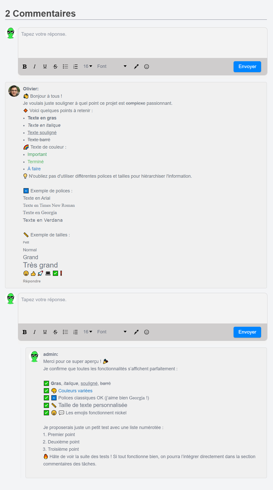

# ⚒️ react-comments-section — version modifiée pour une application avancée

Cette version est une **adaptation personnalisée** de la bibliothèque [`react-comments-section`](https://github.com/RiyaNegi/react-comments-section), modifiée pour mieux s’intégrer dans une **application React plus complexe** sur laquelle je travaille.

## 🎯 Objectif

Adapter une bibliothèque open-source de commentaires :
- à l’esthétique globale de mon application,
- aux contraintes spécifiques de mon projet.

## 🔧 Ce que j’ai modifié

- 🎨 **Amélioration du design** (couleurs, espacements, disposition des éléments)
- ➖ **Suppression de certaines fonctionnalités** jugées inutiles ou inadaptées

## 🧠 Compétences mises en œuvre

- Lecture et compréhension de code open-source
- Refactorisation ciblée sans casser la logique principale
- Sens du design et de la cohérence UI
- Intégration propre dans une architecture React existante

## 🖼️ Aperçu visuel

## 🛠️ Stack utilisée

- React
- CSS / SCSS
- Git & GitHub
